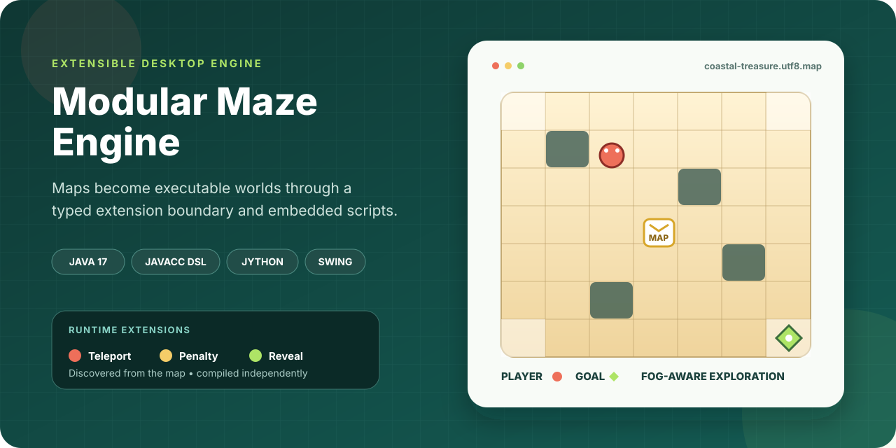
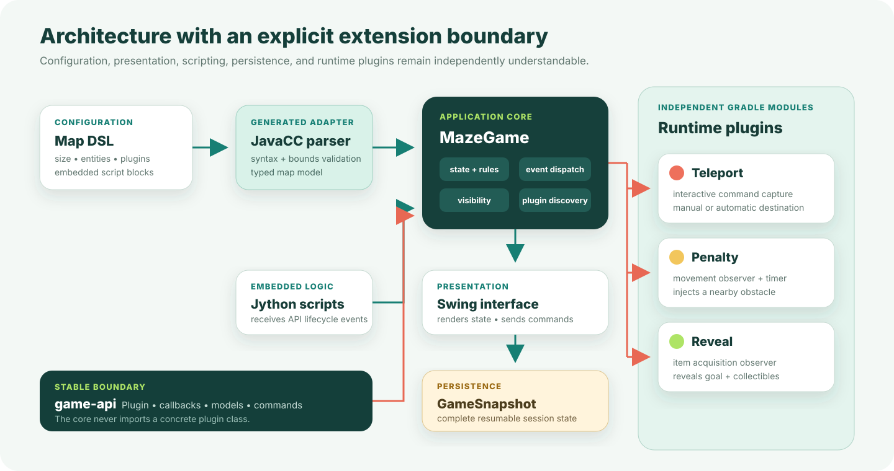

<div align="center">



# Modular Maze Engine

**A Java desktop maze engine where declarative maps select runtime plugins,
embed Jython behavior, and drive a localized Swing experience.**

[](https://github.com/Himath2002/modular-maze-engine/actions/workflows/ci.yml)
[](https://adoptium.net/temurin/releases/?version=17)
[](https://gradle.org/)
[](https://pmd.github.io/)
[](https://github.com/Himath2002/modular-maze-engine/releases)

[Explore the architecture](#architecture) ·
[Run the engine](#run-locally) ·
[Understand the map language](#map-language) ·
[Build a plugin](#extension-model)

</div>

---

## Why this project exists

Many small games hard-code their world, rules, and interface into one
application. Modular Maze Engine takes a different approach: a map file defines
the world and names the extensions it needs, JavaCC validates that
configuration, the core owns gameplay state, and independently compiled plugins
subscribe only to the events they understand.

The bundled **Coastal Treasure** scenario demonstrates the complete pipeline:
fog-aware exploration, inventory-gated obstacles, a scripted prize, nine
selectable interface languages, save/resume support, and three runtime plugins.
Everything runs locally; the application has no network dependency at runtime.

## At a glance

| Area | Implementation |
| --- | --- |
| Runtime | Java 17 desktop application with Swing |
| Configuration | JavaCC-powered map domain-specific language |
| Extension boundary | Dedicated `game-api` module with lifecycle and callback contracts |
| Runtime plugins | Teleport, penalty, and reveal modules loaded by class name |
| Embedded behavior | Jython scripts receiving typed `GameScript` lifecycle events |
| Persistence | Complete serializable session snapshots stored locally |
| Localization | English, French, Sinhala, Spanish, German, Japanese, Italian, Chinese, Russian, and Pig Latin bundles |
| Quality gate | Parser generation, compilation, and PMD across authored Java source |
| Runtime services | None — maps, saves, artwork, and logic remain on-device |

## Experience

The player explores a partially hidden coastal grid, collects items, unlocks
obstacles, and reaches the goal while each move advances the in-game date.

<div align="center">
  <table>
    <tr>
      <td align="center"><br/><strong>Explore</strong><br/>Move through revealed cells</td>
      <td align="center"><br/><strong>Collect</strong><br/>Build the required inventory</td>
      <td align="center"><br/><strong>Discover</strong><br/>Trigger scripted and plugin events</td>
      <td align="center"><br/><strong>Complete</strong><br/>Reach the destination</td>
    </tr>
  </table>
</div>

### Controls

| Context | Input | Result |
| --- | --- | --- |
| Exploration | Arrow keys | Move one cardinal cell |
| Manual teleport | Arrow keys | Move the destination cursor |
| Manual teleport | `Enter` | Confirm the selected destination |
| Manual teleport | `Escape` | Cancel without spending the teleport |
| Header | **Extensions** | Open actions contributed by runtime plugins |
| Settings | **Save / Load** | Write or restore `saves/maze-state.ser` |
| Settings | **Toggle Cheat Mode** | Show or restore fog-hidden cells |

## Architecture



The dependency direction is deliberate:

1. `game-api` defines the contracts and shared entity models.
2. `game-core` depends on that API and owns all mutable application state.
3. Each plugin depends on `game-api`, never on the core or another plugin.
4. The core discovers configured plugins reflectively and registers the callback
   facets they implement.
5. Swing renders engine state and translates user input into engine or
   UI-neutral interaction commands.

The core therefore contains **no import of a concrete plugin class**. A plugin
can be compiled, reasoned about, and replaced independently as long as it
honors the public contracts.

## Extension model

Every runtime extension implements the small base contract:

```java
public interface Plugin {
    String id();
    void initialize(GameAPI api);

    default void shutdown() {
        // Optional resource cleanup.
    }
}
```

Plugins opt into only the event surfaces they need:

| Contract | Event surface | Used by |
| --- | --- | --- |
| `MoveCallback` | Successful player movement | Penalty plugin |
| `ItemCallback` | Collectible acquisition | Reveal plugin |
| `MenuCallback` | User-invoked extension action | Teleport plugin |
| `InteractiveMenuPlugin` | UI-neutral navigation commands | Teleport plugin |

### Bundled plugins

| Plugin | Behavior | State boundary |
| --- | --- | --- |
| **Teleport** | Provides one manual or automatically selected teleport | Reads map state only through `GameAPI`; captures arrow/confirm/cancel commands through `InteractionCommand` |
| **Penalty** | Starts a five-second countdown after movement and injects an adjacent obstacle when the player remains idle | Uses a Swing timer and releases it through `shutdown()` |
| **Reveal** | Reveals the goal and remaining items when a map collectible is acquired | Subscribes only to item acquisition events |

To add another plugin:

1. Create a Gradle subproject that depends on `project(':game-api')`.
2. Implement `Plugin` and any relevant callback interfaces.
3. Put the plugin JAR on the application runtime classpath.
4. Add its fully qualified class name to the map:

```text
plugin io.example.maze.plugins.CompassPlugin
```

No engine switch statement or Swing dependency is required.

## Map language

Maps are plain-text configuration files. The JavaCC grammar recognizes
dimensions, start and goal positions, items, obstacles, plugins, and embedded
script blocks.

```text
size (15,15)
start (2,2)
goal (8,14)

plugin io.github.himath2002.maze.plugins.teleport.TeleportPlugin

item "blue amulet" {
  at (0,1)
  message "A blue amulet was added to your inventory."
}

obstacle {
  at (6,5), (0,2)
  requires "scuffed dagger", "blue amulet"
}
```

During startup, the generated parser rejects non-positive dimensions and any
start, goal, item, or obstacle coordinate outside the configured grid. The
engine then rejects overlapping entities and a start/goal collision before a
window is presented.

The bundled map is located at
[`game-core/src/main/resources/maps/coastal-treasure.utf8.map`](game-core/src/main/resources/maps/coastal-treasure.utf8.map).
UTF-8, UTF-16, UTF-32, and supported byte-order marks are handled by the map
loader.

## Embedded scripting

A map can include a Jython block and expose one global `script` object that
implements the `GameScript` lifecycle:

```python
class ScenarioScript(object):
    def initialize(self, api):
        self.api = api

    def onPlayerMoved(self):
        pass

    def onItemAcquired(self, item_name):
        pass

script = ScenarioScript()
```

The Coastal Treasure script combines unique obstacle crossings and collected
items into a five-step prize objective. Reaching that threshold adds a Golden
Prize Key through the same `GameAPI` used by compiled plugins.

Script evaluation failures are isolated and logged; they do not change the
plugin contracts or the engine's ownership of state.

## Save and resume

The save file captures the complete resumable session:

- player and goal positions;
- current cell contents and visibility;
- inventory and latest item;
- elapsed days and localized date state;
- Golden Prize Key ownership; and
- one-time teleport usage.

The runtime file is written to `saves/maze-state.ser` and intentionally excluded
from version control. A save is accepted only when its dimensions match the
currently loaded map.

## Run locally

### Prerequisite

- JDK 17 — no separate Gradle installation is required.

Verify the toolchain:

```bash
java -version
./gradlew --version
```

### Launch the bundled scenario

```bash
git clone https://github.com/Himath2002/modular-maze-engine.git
cd modular-maze-engine
./gradlew :game-core:run
```

On Windows:

```powershell
gradlew.bat :game-core:run
```

### Launch a custom map

```bash
./gradlew :game-core:run -Pmap=/absolute/path/to/custom.utf8.map
```

Paths with spaces should be quoted by the shell.

### Build an installable distribution

```bash
./gradlew :game-core:installDist
```

The generated launcher and runtime libraries are placed under
`game-core/build/install/game-core/`.

## Verification

Run the same quality gate used by hosted CI:

```bash
./gradlew clean check
```

This command:

- regenerates the JavaCC parser from `MazeMap.jj`;
- compiles the API, core, and three plugin modules with Java 17 and `-Xlint:all`;
- runs PMD 7.22 against authored Java source; and
- executes any module tests registered with Gradle.

The current codebase does not claim a comprehensive automated gameplay test
suite. Release verification therefore combines the reproducible build gate with
a desktop smoke launch of the bundled map, all three plugins, the Jython script,
localization resources, and artwork.

## Project structure

```text
modular-maze-engine/
├── game-api/                    # Stable contracts and shared models
│   └── src/main/java/.../api/
├── game-core/
│   ├── src/main/java/.../
│   │   ├── app/                 # Desktop entry point
│   │   ├── engine/              # State and gameplay rules
│   │   ├── i18n/                # UTF-8 resource loading
│   │   ├── persistence/         # Complete session snapshot
│   │   ├── scripting/           # Jython lifecycle adapter
│   │   └── ui/                  # Swing presentation
│   ├── src/main/javacc/.../     # Map language grammar
│   └── src/main/resources/      # Map, artwork, and locale bundles
├── plugins/
│   ├── penalty/
│   ├── reveal/
│   └── teleport/
├── config/pmd/                  # Project-specific static analysis
├── docs/                        # README and social-preview visuals
└── .github/                     # CI, dependency updates, ownership
```

## Engineering decisions

- **Contracts over concrete coupling.** The API module carries only the surface
  shared across the engine, interface, scripts, and plugins.
- **Configuration is validated before presentation.** Invalid coordinates or
  conflicting entities fail startup instead of creating partially valid state.
- **Generated code is reproducible, not committed.** JavaCC output is produced
  during the build; PMD evaluates authored source rather than generator output.
- **Persistence restores the whole board.** A single typed snapshot replaces
  unchecked, field-by-field deserialization.
- **Interaction state stays extension-owned.** The interface sends semantic
  commands and never casts a callback to a concrete plugin.
- **Runtime artwork is repository-sized.** Source images retain ample display
  resolution without carrying multi-megabyte originals into every clone.

## Current boundaries

- Plugin class names in a map must resolve from the runtime classpath.
- Embedded scripts are dynamically interpreted; semantic errors are discovered
  when that map loads or receives an event.
- Gameplay is intentionally desktop-first and requires a graphical environment.
- Save files use Java serialization and are not a cross-version interchange
  format.
- The project has compile/static-analysis automation but not exhaustive
  behavioral coverage.

These are explicit constraints of the current release, not hidden promises.

## Security and responsible use

See [SECURITY.md](SECURITY.md) for the private reporting process. The application
does not transmit maps, saves, inventory, or interaction data to an external
service.

## Authorship and reuse

Designed and developed by
[Himath Ahangama](https://github.com/Himath2002).

This repository is published for source and engineering review. It does not
grant an open-source license. Bundled visual assets are included to demonstrate
the application, and no reuse rights are granted for those assets. Contact the
author before redistributing code or artwork.

Release history is recorded in [CHANGELOG.md](CHANGELOG.md).
